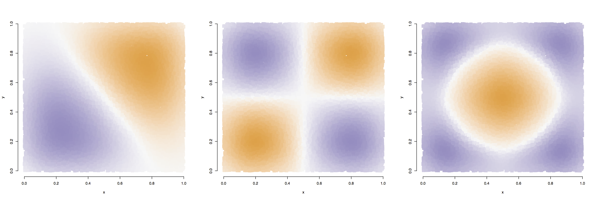

Spatial confounding in Cox process models
===
author: Wesley Brooks
date: University of New South Wales

An example: *Eucalyptus sparsifolia*
===
- Analysis method for presence-only data, e.g.: Locations of 230 presence-only *Eucalyptus sparsifolia* observa-tions within 100 km of the Greater Blue Mountains World Heritage Area (source: Renner *et al.*, 2015).

*Eucalyptus sparsifolia* data
===
- Goal in analyzing the *Eucalyptus sparsifolia* data is a regression model that explains the effect of environmental covariates and maps the underlying distribution of *Eucalyptus sparsifolia*.
- Covariates:
  + Rainfall
  + Max, min annual average temperature
  + Frequency of fires
  + Soil type
  + Distance from roads and urban areas

*Eucalyptus sparsifolia* models 
===
- Source: Renner *et al.* (2015)
- Downweighted Poisson regression (DWPR)
- Log-Gaussian Cox process (LGCP)

Covariate | Est. coef (DWPR) | Est. coef (LGCP)|
|:-:|:-:|:-:|
| Intercept | -715.8 | -11.6 |
| Fire count | -3.4 | -7.8 |
| Min temp. | -29.2 | -1.8 |
| Max temp. | 43.5 | -0.1|
| Rainfall | 326.4 | -7.6 |

- It was proposed in the paper that the difference was down to **spatial confounding**.

Overview
===
- When analyzing presence-only data that exhibits spatial structure beyond that explained by covariates, a Cox process model may be useful.
- A Cox process may introduce a spatial random effect that is correlated with the covariates, leading to spatial confounding.
- We propose a method to implement a Cox process model that avoids spatial confounding by restricting the random effect to be orthogonal to the fixed effects.
- Also present a method to quickly estimate parameters of a Cox process via fixed-rank spatial effect and a variational approximation.

Outline
===
- Point process models
  + Homogeneous Poisson
  + Inhomogeneous Poisson
  + Cox process
- Estimation
- Spatial confounding
- Spatial random effects
- Variational approximations and the `cox` package
- Simulation study

Poisson point process
===
- Homogeneous: assume a constant intensity $\lambda$ on domain ${\mathcal D}$ with area $|{\mathcal D}|$.
  - Number of points $N$ is distributed as $N \sim {\rm Pois}(\lambda |{\mathcal D}|)$.
  - Location of points follows uniform distributon on the domain
- Inhomogeneous: intensity varies with location ${\boldsymbol s}$: $\lambda({\boldsymbol s})$
  - Now $N \sim {\rm Pois}\{\int_{\mathcal D} \lambda({\boldsymbol s}) d{\boldsymbol s}\}$
  - Point density is proportional to $\lambda({\boldsymbol s})$.
  - Likelihood of an observed data set from an inhomogeneous Poisson process:
    $$ {\mathcal L}\{\lambda (\cdot)\} = \left\{\int_{\mathcal D} \lambda({\boldsymbol s}) d{\boldsymbol s}\right\}^N \exp{\left\{ -\int_{\mathcal D} \lambda({\boldsymbol s}) d{\boldsymbol s} \right\}} / N! $$

Inhomogeneous Poisson process
===
- Regression: suppose the intensity is a function of some covariates ${\boldsymbol X}$.
  - E.g., $\lambda({\boldsymbol s}) = \exp{\{ {\boldsymbol x}'({\boldsymbol s}) {\boldsymbol \beta} \}}$
- Renner *et al.* (2015) proposed a "down-weighted Poisson regression" (DWPR) for estimation.
  - Uses numerical quadrature to evaluate the integral $\int_{\mathcal D} \lambda({\boldsymbol s}) d{\boldsymbol s}$.
  - Numerical quadrature: discretize the domain into cells and sum the values in the cells (Berman and Turner, 1992).
  - May require quadrature points numbering $10^4 - 10^6$.

*Eucalyptus sparsifolia* revisited
===
After modeling the disribution of *Eucalyptus sparsifolia* as an inhomogenous Poisson process, check for clustering:
 - Both K-function and the Pearson residuals indicate clustering not explained by the model (figures source: Renner *et al.*, 2015).

Cox process
===
- Often in regression models with spatially indexed observations, we include a factor to account for local similarity not explained by the covariates.
  - Geostatistical correlation functions
  - Conditional autoregressive models
- Cox process is an inhomogeneous Poisson process where
  - $\lambda({\boldsymbol s}) = \exp{\{ {\boldsymbol x}'({\boldsymbol s}) {\boldsymbol \beta} + \zeta({\boldsymbol s}) \}}$
  - ${\boldsymbol \zeta} \sim MVN({\boldsymbol 0}, {\boldsymbol \Sigma})$
  - $\Sigma_{ij} = C({\boldsymbol s}_i, {\boldsymbol s}_j)$ is a spatial covariance function
  

Outline
===
- Point process models
  + Homogeneous Poisson
  + Inhomogeneous Poisson
  + Cox process
- Estimation
- Spatial confounding
- Spatial random effects
- Variational approximations and the `cox` package
- Simulation study

Spatial confounding
===
- "_Adding spatially-correlated errors can mess up the fixed effect you love_" (Hodges and Reich, 2010)
- In general, ${\boldsymbol \zeta}$ may be correlated with columns of ${\boldsymbol X}$, which will affect the estimates ${\hat \beta}$
- Consider a linear mixed model, representing a conditional autoregressive (CAR) model with neighborhood matrix ${\boldsymbol Q}$:
$${\boldsymbol y} = {\boldsymbol X} {\boldsymbol \beta} + {\boldsymbol I}_n {\boldsymbol S} + {\boldsymbol \varepsilon}$$
- Where ${\boldsymbol{S}} \sim MVN \left( {\boldsymbol 0}, (\tau_s {\boldsymbol Q})^{-1} \right)$
- Eigendecomposition of neighborhood matrix: ${\boldsymbol Q} = {\boldsymbol Z} {\boldsymbol D} {\boldsymbol Z}'$
- Now let ${\boldsymbol b} = {\boldsymbol Z}'{\boldsymbol S} \sim MVN \left( {\boldsymbol 0}, (\tau_s {\boldsymbol D})^{-1} \right)$

Spatial confounding (source: Hodges and Reich, 2010)
===
- Rewrite the model:
$$ {\boldsymbol y} = {\boldsymbol X} {\boldsymbol \beta} + {\boldsymbol Z} {\boldsymbol b} + {\boldsymbol \varepsilon}$$
- The eigenvalues $d_j, j=1, \dots, r$ are shrinkage parameters for components of the random effect.
- Any column of ${\boldsymbol Z}$ that is colinear with ${\boldsymbol X}$ and has little shrinkage is confounded with the fixed effects.
- Equivalently: any eigenvector of the spatial precision matrix that is colinear with ${\boldsymbol X}$ and has a small eigenvalue is confounded with the fixed effects.
- Confounding biases coefficient estimates.

Spatial confounding
===
- Spatial confounding has been identified in areal and geostatistical regression models, with various interpretations
  - Unaccounted-for explanatory variable, in a geostatistical context (Paciorek, 2011)
  - Covariates having spatial structure on the observational units (Hodges and Reich, 2010)
- Typical prescription has been to project the model's spatial random component into a subspace orthogonal to the covariates (Hodges and Reich, 2010; Hughes and Haran, 2013).
- What about point processes?

Spatial confounding in Cox process models
===
- Cox process models use $10^4 - 10^6$ quadrature points
- Covariance matrix of spatial random process may be $10^6 \times 10^6$
- Typical methods of accounting for spatial confounding are impractical for Cox process model
  + Impractical to calculate the matrix of distances between locations for a geostatistical covariance model
  + After projection orthogonal to the covariates, the neighborhood matrix for a CAR model would not be sparse
  + Eigendecomposition, etc. are expensive
- This makes it impossible to assess degree of confounding

Outline
===
- Point process models
  + Homogeneous Poisson
  + Inhomogeneous Poisson
  + Cox process
- Estimation
- Spatial confounding
- Spatial random effects
- Variational approximations and the `cox` package
- Simulation study

Spatial random effects
===
Cressie and Johannesson (2008) introduced "Fixed rank kriging"

- Approximates a Gaussian random field as the sum of a fixed number of basis functions
- Can use your favorite basis, multiresolution basis is recommended (Nychka *et al.*, 2002)
- E.g., multi-resolution bisquare functions
- Results in a low-rank random effect that is easily projected orthogonal to the fixed effects!

Multiresolution bisquares
===

 ${\boldsymbol u} \sim MVN({\boldsymbol 0}, \tau {\boldsymbol I}_r)$

Outline
===
- Point process models
  + Homogeneous Poisson
  + Inhomogeneous Poisson
  + Cox process
- Estimation
- Spatial confounding
- Spatial random effects
- Variational approximations and the `cox` package
- Simulation study

Marginal likelihood
===
- The likelihood to maximize is marginal to the random effects
  + i.e., with the random effects "integrated out"
- For our model, this looks like
$$\pi({\boldsymbol y}) = \int_U \pi({\boldsymbol y} | {\boldsymbol u}) \pi({\boldsymbol u}) {\rm d}{\boldsymbol u} $$

$$= \int_U \left[\int_{\mathcal D} \exp\left\{ {\boldsymbol x}'({\boldsymbol s}){\boldsymbol \beta}({\boldsymbol s}) + \boldsymbol{Su}\right\} d{\boldsymbol s}\right]^N \times $$
$$\exp\left[\int_{\mathcal D} \exp\left\{ {\boldsymbol x}'({\boldsymbol s}){\boldsymbol \beta}({\boldsymbol s}) + \boldsymbol{Su}\right\} d{\boldsymbol s}\right] / N! \times \left(\frac{\tau}{2\pi}\right)^{r/2} \exp{ \left( - \tau \frac{ {\boldsymbol u}'{\boldsymbol u}}{2}\right) } {\rm d}{\boldsymbol u} $$

Variational approximation
===
- Evaluating the integral analytically is not practical (possible?).
- Markov chain Monte Carlo is a common approach to approximating the integral, but slow.
- We propose a variational approximation to the marginal likelihood (Ormerod and Wand, 2010; Hui *et al.*, unpublished)
- The variational lower bound for an arbitrary density $q$ is a result of Jensen's inequality:
$$ \log \pi({\boldsymbol y}) \ge \int_U q({\boldsymbol u}) \log \left\{ \pi({\boldsymbol y}, {\boldsymbol u}) / q({\boldsymbol u}) \right\} {\rm d}{\boldsymbol u} $$

Variational approximation
===
- Rewrite the likelihood lower bound:
$$ \int_U  \log \left\{ \pi({\boldsymbol y}, {\boldsymbol u}) \right\} q({\boldsymbol u}) {\rm d}{\boldsymbol u} - \int_U \log \left\{ q({\boldsymbol u}) \right\} q({\boldsymbol u}) {\rm d}{\boldsymbol u} $$
- Get the joint log-likelihood just by writing the hierarchical model, ignoring constants:
$$ \log\{\pi({\boldsymbol y}, {\boldsymbol u})\} = \sum_{i=1}^n \left[ w_i\left\{ y_i ({\boldsymbol x}_i' {\boldsymbol \beta} + {\boldsymbol S}_i' {\boldsymbol u}) - \exp ({\boldsymbol x}_i' {\boldsymbol \beta} + {\boldsymbol S}_i' {\boldsymbol u}) \right\} \right] \\ + r/2 \log (\tau) - {\boldsymbol u}'{\boldsymbol u} / (2 \tau) $$

- Assume that $q$ is multivariate Gaussian with expectation ${\boldsymbol M}$ and variance ${\boldsymbol V}$.

Variational approximation
===
- Now finding the likelihood bound requires only that we calculate a few expectations with respect to a multivariate normal distribution:
  + $\boldsymbol{u} \sim MVN(\boldsymbol{M}, \boldsymbol{V})$
  + $E_u (\boldsymbol{u}'\boldsymbol{u} | \boldsymbol{M}, \boldsymbol{V})$
  + $E_u (\boldsymbol{Su} | \boldsymbol{M}, \boldsymbol{V})$
  + $E_u \{ \exp(\boldsymbol{Su}) | \boldsymbol{M}, \boldsymbol{V} \}$

- Maximize the lower bound by the method of conjugate gradient: requires only the first derivative of the lower bound
- `R` package is under active development, available via `devtools` from `github.com/wrbrooks/cox`.

*Eucalyptus sparsifolia* models 
===
- Using a slightly different model than Renner *et al.* (2015) (no soil type), we estimate the coefficients:

Covariate | DWPR | orthogonalized | nonorthogonalized |
|:-:|:-:|:-:|:-:|
| Intercept | -793.6 | -222.8 | 95.8 |
| Fire count | -6.6 | -0.7 | 1.3 |
| Min temp. | -25.9 | -15.4 | -6.7 |
| Max temp. | 47.8 | 14.4 | -4.9 |
| Rainfall | 365.5 | 85.9 | -40.6 |

Estimated random effects
===
- Left: not orthogonalized, right: orthogonalized
 

Recall:
===

Outline
===
- Point process models
  + Homogeneous Poisson
  + Inhomogeneous Poisson
  + Cox process
- Estimation
- Spatial confounding
- Spatial random effects
- Variational approximations and the `cox` package
- Simulation study

Simulaton study
===
- Design: generate covariates that are known to correlate with the random effect process
  + Fix locations of the quadrature points and compute the matrix of multiresolution bisquares, ${\boldsymbol S}$
  + Find the second, third, and fourth singular vectors of ${\boldsymbol S}$
  + Model these singular vectors using a GAM, so that their values can be computed at any location
  + These are the covariates.
- Simulate the linear predictor: $\eta = \boldsymbol{X \beta} + \boldsymbol{\zeta}$
  + $\boldsymbol{\beta} = (1, -0.2, 0)$ 
  + ${\boldsymbol \zeta} \sim \rm{GRF}(\sigma^2=0.5, \tau=0.1)$ (exponential covariance)

Simulation study: covariates
===

Simulation study
===
- Scale the covariates
 + `scale.X = 1, 2, 4` (Increase signal strength)
- Scale the random field
  + `scale.re = 1, 0.5` (decrease noise)
- Alter the intercept
  + $\beta_0$ `= 4, 5, 6` (Increase sample size)
- Estimate the regression parameters under multiresolution bisquares, both orthogonalized and nonorthogonalized.  

Simlation results
===
- No apparent difference between orthogonalized, nonorthogonalized estimation!
  + Bias
  + MSE
  + Estimated coefficient variance/confidence intervals
  + Why? 
- Relative to DWPR (no spatial effect) coefficient standard errors were smaller.

 
References
===
Berman, M. and Turner, T.R. (1992), "Approximating point process likelihoods with GLIM," *Journal of the Royal Statistical Society, Series C,* 41, 77-91.

Cressie, N., and Johannesson, G. (2008), "Fixed rank kriging for very large spatial data sets," *Journal of the Royal Statistical Society (Ser. B),* 70(1), 209-226.

Hodges, J.S. and Reich, B.J. (2010), "Adding spatially-correlated errors can mess up the fixed effect you love," *The American Statistician,* 64(4), 325-334.

Hughes, J. and Haran, M. (2013) "Dimension reduction and alleviation of confounding for spatial generalized linear mixed models," *Journal of the Royal Statistical Society, Series B,* 75(1), 139-159.

References
===
Hui, F.K.C., Warton, D.I., Ormerod, J.T., Haapaniemi, V., and Taskinen, S. (2015), "Variational approximations for generalized linear latent variable models," *unpublished*.

Ormerod, J.T., and Wand, M.P. (2010), "Explaining variational approximations," *The American Statistician,* 64(2), 140-153.

Renner, I.W., Elith, J., Baddeley, A., Fithian, W., Hastie, T., Phillips, S.J., Popovic, G., and Warton, D.I. (2015), "Point process models for presence-only analysis," *Methods in Ecology and Evolution,* 6, 366-379.

